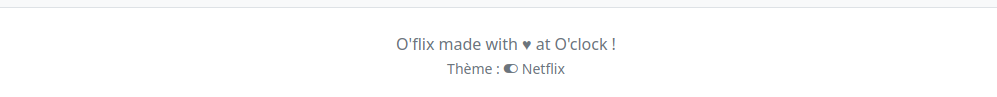

# Theme Switcher

Un sélecteur de thème est un bon cas d'usage pour l'usage des sessions ! (voire des cookies).

## Objectif

- Créer un lien dans le pied de page pour alterner entre *"thème standard"* (Netflix) et *"thème Allociné"*.
- Utiliser la Session Symfony pour gérer l'alternance du thème entre les requêtes (https://symfony.com/doc/current/controller.html#managing-the-session).
- Selon si le thème alternatif est actif ou non, conditionner les classes CSS de la nav (CSS à modifier le cas échéant).
- Cerise sur le gâteau, conditionner l'état du bouton de sélection selon le thème actif.
